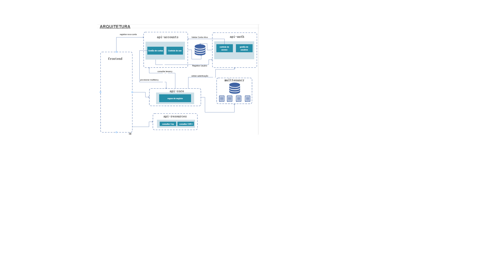
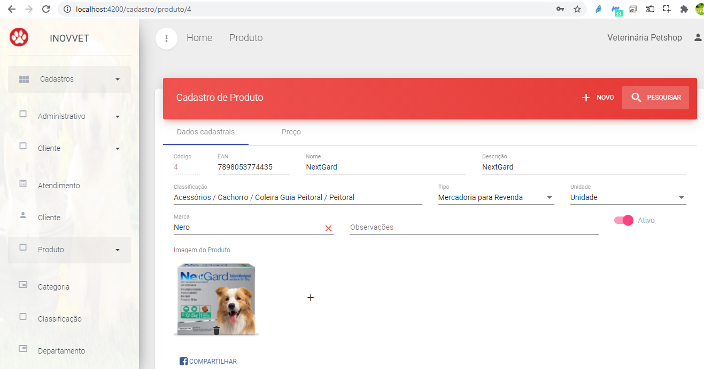
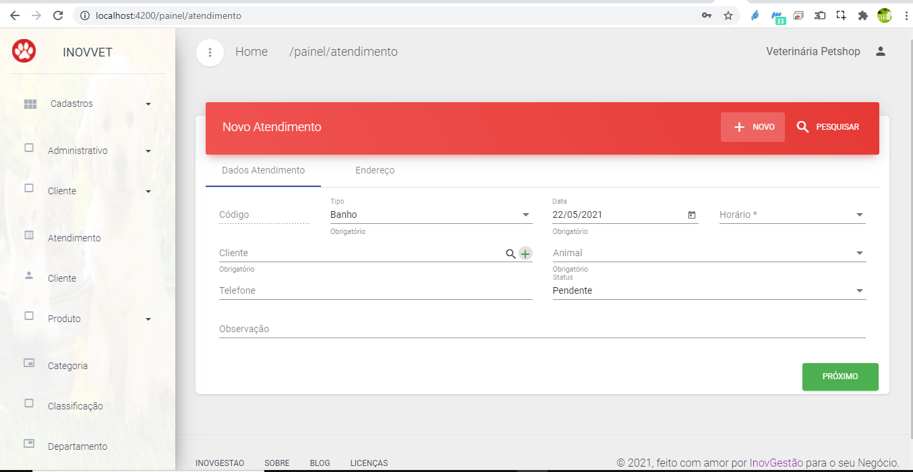

# inovvet
O projeto **inovvet** foi elaborado com intuito de proporcionar a pratica de novos conceitos aprendidos através de livros e cursos online, muitos desses conceitos foram utilizados como base para outros projetos.
O projeto abordado nesse repositório consiste em arquitetura ***distribuida de serviços***.

a finalidade era elaborar uma arquitetura distribuida, com objetivo de criar um ecosistema **SaaS**.
Com objetivo definido foi identificado a necessidade de criação das seguinte estrutura de software, para atender esse objetivo foi desenvolvido alguns micro serviços om os frameworks abaixo:
 - Spring
 - SpringBoot
 - Flyway
 - Hibernate
 
 para compor o projeto foi realizado as seguintes integrações:
 -  https://www.receitaws.com.br/
 -  https://viacep.com.br/ws/
 -  https://aws.amazon.com/pt/s3/

Abaixo será demonstrado o objetivo de cada serviço.
### accounts-api

  Serviço responsável pelo controle de novas contas da plataforma e registro de novos usuários, quando uma nova conta é registrada esse serviço deve solicitar o provisionamento na plataforma de Core.
### auth-api
	
  Serviço responsável por realizar a gestão de segurança através do protocolo OAuth 2	com o fluxo de autorização Resource Owner Password Credentials e Client Credentials
### core-api
	
  Serviço responsável pela regras de negócio da aplicação em um arquitetura SaaS.
	- Multitenancy
  - AWS S3 	
  - JavaMailSender
  - CriteriaBuilder
  
#### resources-api
	
  Serviço responsável prover recursos extras como a consulta de cep e cnpj. 
  
  
  
  Como todo o sistema deve atender ou facilitar rotinas do dia a dia , desta forma foi escolhido o seguimento de varejo PET para validar a aplicabilidade do projeto com os seguintes recursos.
  - Cadastro de Clientes
  - Cadastro de Animais
  - Cadastro de produtos
  - Definição de arvóre mercadológica
  - Gestão de atendimento

	

